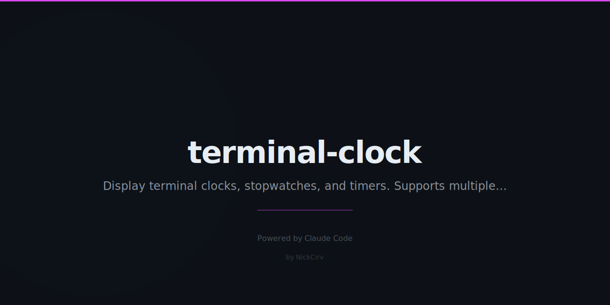

# terminal-clock

Developer terminal clock with multiple timezones, stopwatch, countdown timer, and pomodoro mode.

**Zero dependencies.** Pure Node.js ES modules. Node 18+.

## Install

```bash
npm install -g terminal-clock
```

Or run directly with npx:

```bash
npx terminal-clock
```

## Usage

### Live Clock (local timezone)
```bash
tclock
```

### Multi-Timezone World Clock
```bash
tclock --tz "America/New_York,Europe/London,Asia/Dubai"
```
Displays timezones side by side with big ASCII digits.

### Stopwatch
```bash
tclock stopwatch
```

Controls:
- `Space` — Start / Pause
- `L` — Record lap
- `R` — Reset
- `q` — Quit

### Countdown Timer
```bash
tclock timer 25m       # 25 minutes
tclock timer 1h30m     # 1 hour 30 minutes
tclock timer 90s       # 90 seconds
```

Beeps with bell character on completion. Progress bar shows elapsed percentage. Color shifts to yellow under 5 minutes, red under 1 minute.

### Pomodoro Mode
```bash
tclock pomodoro
```

25-minute work cycles with 5-minute breaks. Bell on every transition. Tracks session count.

## Options

| Flag | Description |
|------|-------------|
| `--tz "TZ1,TZ2"` | Comma-separated IANA timezones |
| `--format 12` | 12-hour clock format (default: 24h) |
| `--no-seconds` | Hide seconds |

## Examples

```bash
# Multi-timezone with 12h format
tclock --tz "America/New_York,Europe/London,Asia/Dubai" --format 12

# Quick 10-minute timer
tclock timer 10m

# Clock without seconds
tclock --no-seconds
```

## Supported Timezones

Any valid IANA timezone string works:

```
America/New_York      America/Los_Angeles    America/Chicago
Europe/London         Europe/Paris           Europe/Berlin
Asia/Dubai            Asia/Tokyo             Asia/Singapore
Australia/Sydney      Pacific/Auckland
```

## Features

- Big ASCII 7-segment digit display
- All modes: `q` to quit, cursor hidden during display
- Timezone detection via `Intl.DateTimeFormat`
- Timer and pomodoro beep with `\x07` bell
- Stopwatch records unlimited laps with split times
- Color-coded urgency in timer/pomodoro (green → yellow → red)
- No npm dependencies — just Node.js built-ins

## License

MIT
