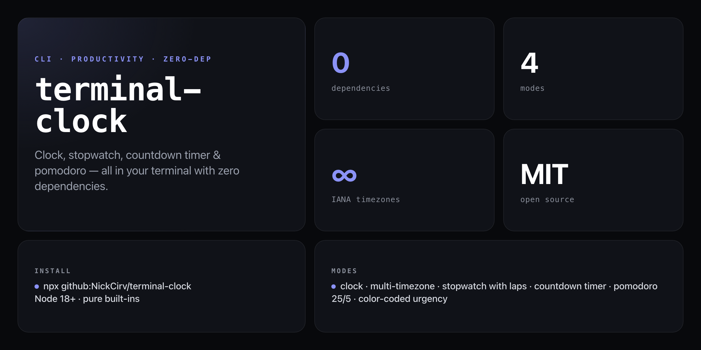

<div align="center">

**Clock, stopwatch, countdown timer, and pomodoro — all in your terminal. Zero dependencies.**


</div>

---

`terminal-clock` is a zero-dependency Node.js CLI that turns your terminal into a productivity time-keeper. Big ASCII 7-segment digits, IANA timezone support, stopwatch laps, color-coded urgency countdowns, and automatic Pomodoro cycles — all with pure Node built-ins, nothing to `npm install`.

```
  ███  ███     ███  ███     ███  ███
  █ █  █ █  █  █ █    █  █  █ █    █
  █ █  █ █     ███  ███     █ █  ███
  █ █  █ █  █    █  █ █  █  █ █  █ █
  ███  ███     ███  ███     ███  ███

  New York (EST)  |  Monday, June 18, 2026     q to quit
```

## Install

No npm account needed — runs straight from GitHub:

```bash
npx github:NickCirv/terminal-clock
```

## Usage

### Live Clock (local timezone)
```bash
tclock
```

### Multi-Timezone World Clock
```bash
tclock --tz "America/New_York,Europe/London,Asia/Dubai"
```

Displays each timezone side by side with big ASCII digits.

### Stopwatch
```bash
tclock stopwatch
```

| Key | Action |
|-----|--------|
| `Space` | Start / Pause |
| `L` | Record lap |
| `R` | Reset |
| `q` | Quit |

### Countdown Timer
```bash
tclock timer 25m       # 25 minutes
tclock timer 1h30m     # 1 hour 30 minutes
tclock timer 90s       # 90 seconds
```

Progress bar shows elapsed percentage. Color shifts to yellow under 5 minutes, red under 1 minute. Three-beep bell on completion.

### Pomodoro Mode
```bash
tclock pomodoro
```

25-minute work cycles with automatic 5-minute breaks. Bell on every phase transition. Tracks session count and completed cycles.

## Options

| Flag | Description |
|------|-------------|
| `--tz "TZ1,TZ2"` | Comma-separated IANA timezone strings |
| `--format 12` | 12-hour clock format (default: 24h) |
| `--no-seconds` | Hide seconds |
| `--help` | Show help |

## Examples

```bash
# Multi-timezone with 12h format
tclock --tz "America/New_York,Europe/London,Asia/Dubai" --format 12

# Quick 10-minute focus timer
tclock timer 10m

# Clock without seconds
tclock --no-seconds
```

## Supported Timezones

Any valid IANA timezone string. Common examples:

```
America/New_York      America/Los_Angeles    America/Chicago
Europe/London         Europe/Paris           Europe/Berlin
Asia/Dubai            Asia/Tokyo             Asia/Singapore
Australia/Sydney      Pacific/Auckland
```

Timezone detection uses `Intl.DateTimeFormat` — no lookup tables, no bundled data.

## What it does

- **Big ASCII digits** — 7-segment style, 5 rows tall, rendered in-place with ANSI cursor positioning
- **Multi-timezone clock** — display any number of IANA zones simultaneously, stacked vertically
- **Stopwatch** — unlimited lap recording with split and total times, 50 ms refresh
- **Countdown timer** — color-coded urgency (green → yellow → red), progress bar, three-beep alert
- **Pomodoro** — automatic work/break cycling, session counter, phase-transition beep

## What it is NOT

- **Not a system clock replacement.** It reads `new Date()` from your Node process — accuracy depends on your OS time sync (NTP).
- **Not a notification system.** The only alert is the `\x07` terminal bell — no desktop notifications, no webhooks, no persistence.
- **Not a GUI app.** Designed for terminal use only; it writes raw ANSI escape codes directly to `process.stdout`.

---

<div align="center">
<sub>Zero dependencies · Node 18+ · MIT · by <a href="https://github.com/NickCirv">NickCirv</a></sub>
</div>
